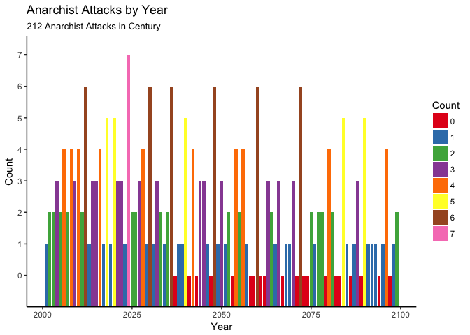

### Evaluate All 21st Century Dates


```r
mydate <- as.Date('2001-01-01')
i <- 1; results <- matrix(nrow=212,ncol=3)
repeat {
mymonth <- as.numeric(format(mydate,'%m'))
myday <- as.numeric(format(mydate,'%d'))
myyear <- as.numeric(format(mydate,'%y'))

if (mymonth*myday == myyear) {results[i,1] <- as.Date(mydate); i<-i+1}

mydate <- mydate+1
if (mydate==as.Date('2100-01-01')) break
}
# Get year of each attack
results[,2] <- as.numeric(format(as.Date(results[,1]),'%Y'))

# Get gaps between dates
results[2:212,3] <- diff(results[,1])
```

### How Many Attacks Will Happen? 212
### What Year Will Have the Most Vandalism? 2024 How Many? 7

### What Year Will the Least Vandalism? Multiple Years Have No Attacks, See Chart Below

### What is the Longest Gap Between Attacks? 1097 days
### What is the Shortest Gap Between Attacks? 16 days

## Chart of Results
<!-- -->

