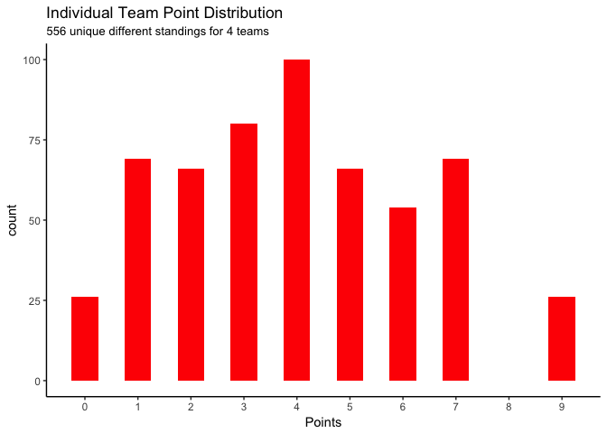

## Simulate 20,000 Rounds of 6 Matches


```r
results <- matrix(0, ncol=4, nrow=20000)

i <- 1

repeat{
points<-c(a=0,b=0,c=0,d=0)
#a-b
winner <- sample(1:3,1)
if(winner==1) points['a']<-points['a']+3 else
if(winner==2) points['b']<-points['b']+3 else {points['a']<-points['a']+1;points['b']<-points['b']+1 }
#a-c
winner <- sample(1:3,1)
if(winner==1) points['a']<-points['a']+3 else
if(winner==2) points['c']<-points['c']+3 else {points['a']<-points['a']+1;points['c']<-points['c']+1 }
#a-d
winner <- sample(1:3,1)
if(winner==1) points['a']<-points['a']+3 else
if(winner==2) points['d']<-points['d']+3 else {points['a']<-points['a']+1;points['d']<-points['d']+1 }
#b-c
winner <- sample(1:3,1)
if(winner==1) points['b']<-points['b']+3 else
if(winner==2) points['c']<-points['c']+3 else {points['b']<-points['b']+1;points['c']<-points['c']+1 }
#b-d
winner <- sample(1:3,1)
if(winner==1) points['b']<-points['b']+3 else
if(winner==2) points['d']<-points['d']+3 else {points['b']<-points['b']+1;points['d']<-points['d']+1 }
#c-d
winner <- sample(1:3,1)
if(winner==1) points['c']<-points['c']+3 else
if(winner==2) points['d']<-points['d']+3 else {points['c']<-points['c']+1;points['d']<-points['d']+1 }

results[i,] <- points
if (i==20000) break else i<-i+1 }

results<-unique(results)
nrow(results)
```

```
## [1] 556
```

## Results

<!-- -->

